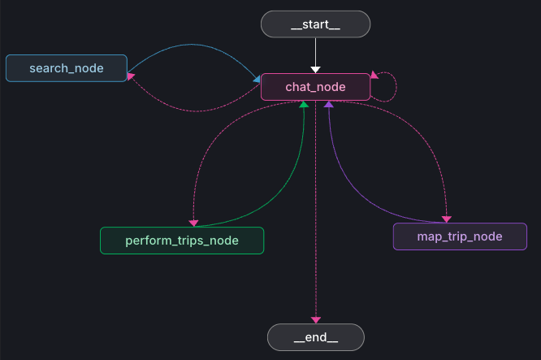

# CityScans 
cityscans is an AI-driven application designed to help users plan their travels. It leverages LLMs and mapping tools to suggest destinations, create trips, and organize travel itineraries.

## Features

- **Conversational Trip Planning:** Chat with an AI agent to plan trips, add places, and get recommendations.
- **Automated Itinerary Creation:** Automatically generate trips with suggested places, restaurants, and activities.
- **Map Integration:** Visualize trips and destinations on interactive maps.
- **Trip Management:** Add, modify, and finalize trips with ease.

## Project Structure

### Agent Orchestration
- **agent/travel/agent.py:** Core logic for the conversational travel agent.
- **agent/travel/agent_map.py:** Defines the main graph for trip planning and mapping.
- **agent/langgraph.json:** Configuration for the LangGraph workflow.
- **agent/.langgraph_api/:** Stores checkpoints and state for LangGraph operations.

### Agent State
- **agent/travel/state.py:** Maintains conversation and trip state.

### Supervisor Node
- **agent/travel/chat.py:** Handles chat interactions.

### Tool Nodes
- **agent/travel/search.py:** Search and recommendation logic for places using Google Maps API
- **agent/travel/trips.py:** Trip data structures and management.
- **agent/travel/map_trip.py:** Manages mapping and trip visualization using Mapbox GL 

### Agent Flow


## Setup

1. **Clone the repository:**
   ```sh
   git clone <repo-url>
   cd cityscans/cityscans/agent
2. **Install dependencies:**
   ```sh
    pip install -r requirements.txt
3. **Configure environment**
Copy .env.example to .env and fill in required API keys and settings.

4. **Run the application**
- (Instructions depend on the entry point; typically, you would run a script in agent/travel/ or launch a UI from ui/.)
- Langraph Studio can be used to run the agent.py file

## Development
- Jupyter Notebooks: Prototyping and development in notebooks/dev_v1.ipynb.
- UI: Frontend code (if any) is in agent/ui/ (pending)
- Langraph Studio for interactive prototyping

## Notes
- Checkpoints and vector stores in .langgraph_api/ are auto-generated and should not be edited manually.
- The project uses LangGraph for orchestrating conversational workflows.